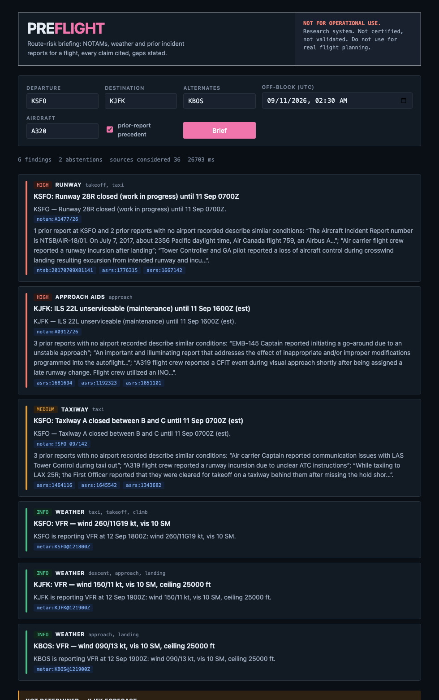

# Preflight

**An agentic route-risk briefing system for flight operations — every claim cited, every capability measured, and explicit about what it doesn't know.**

Give it a flight. It reads every NOTAM, weather product and relevant historical incident for that
route, and returns a ranked hazard briefing where each sentence traces back to a source record.

```
$ preflight brief KSFO KJFK --alt KBOS --off-block 2026-09-11T02:30Z --type A320
```

> [!WARNING]
> **Not for operational use.** Preflight is a research and portfolio system. It is not certified,
> not validated, and must not be used for real flight planning. It is built against public
> aeronautical data to study a hard information-retrieval problem — not to replace an official
> preflight briefing.

---

## The problem

Before every flight, a crew receives a briefing package: a wall of ALL-CAPS telegraphic text listing
every closed taxiway, unlit obstacle, out-of-service navaid and temporary flight restriction along the
route. A transcontinental package routinely runs 60–100 pages. The critical item and the trivial item
are formatted identically, sorted by nothing useful, and written in an ICAO contraction dialect that
takes years to read fluently.

This is a documented safety problem. In the NTSB's investigation of **Air Canada 759** — the 2017
near-miss where an A320 descended toward an occupied taxiway at SFO — the crew did not recall the
NOTAM announcing that the parallel runway was closed, despite it being in the package they were
issued. The FAA has had a NOTAM modernization effort running since.

So: high-volume, badly-structured, genuinely hard-to-parse text, where **missing something and crying
wolf are both failures**. That second half is the interesting part.

---

## What makes this tractable to evaluate

Most retrieval systems are graded on vibes, because there is no ground truth for "was that a good
answer?"

Preflight has one. Aviation incidents are publicly investigated after the fact. That means you can
reconstruct the data that existed **60 minutes before a documented event** and ask a question with an
objectively correct answer:

> Did the briefing surface the hazard that the investigation later found contributed?

Pair those positive cases with **matched negative controls** — uneventful flights matched on airport,
hour and season — and you can measure recall and false-alarm rate on the same footing. Alert fatigue
is the real failure mode of every safety system ever fielded, so precision is not a secondary metric.

One constraint shapes how that set gets built: nobody hands out historical NOTAMs (see
[ADR 0002](docs/adr/0002-notam-access-and-the-provider-abstraction.md)). So every fetch is archived
raw from day one, negatives come from that archive going forward, and positives older than the
archive come from NTSB docket exhibits, which include the NOTAMs in effect at the time.

This eval design is the centre of the project. Everything else is in service of it.

---

## What it does today



`preflight serve` then open http://localhost:8000 — findings stream in as they resolve, every citation
clicks open to its source passage. For the runway closure at KSFO, the precedent search returned the
NTSB investigation of **Air Canada 759** — the incident this project is motivated by — with nothing tuned
for it.

The same briefing in the terminal, against the bundled sample NOTAMs and live weather. No model in the
loop; every claim carries a citation with a verbatim quote, and the schema makes an uncited claim
impossible.

```
KSFO → KJFK (alt KBOS)  ·  A320  ·  off-block 11 Sep 0230Z
6 findings · 3 abstentions
──────────────────────────────────────────────────────────
[HIGH] RUNWAY        KSFO: Runway 28R closed (work in progress) until 11 Sep 0700Z
       takeoff, taxi
       KSFO — Runway 28R closed (work in progress) until 11 Sep 0700Z.
       [notam:A1477/26]

[HIGH] APPROACH AIDS KJFK: ILS 22L unserviceable (maintenance) until 11 Sep 1600Z (est)
       approach
       [notam:A0912/26]

[MED ] TAXIWAY       KSFO: Taxiway A closed between B and C until 11 Sep 0700Z (est)
       taxi
       [notam:!SFO 09/142]

[INFO] WEATHER       KSFO: VFR — wind 300/7 kt, vis 10 SM
       taxi, takeoff, climb
       [metar:KSFO@120600Z]
…
[ ⊘  ] NOT DETERMINED  KJFK forecast
       No TAF for KJFK covers 11 Sep 0300Z–11 Sep 1030Z.  [no_coverage]

[ ⊘  ] NOT DETERMINED  KBOS NOTAMs
       No NOTAMs on record for KBOS; the archive does not cover this airport, so NOTAM
       hazards were not assessed.  [no_coverage]

sources considered: 9 · 19 ms
```

Those abstentions are correct, not a bug: the flight was yesterday and the only TAFs on record
were issued today, and the archive holds only the bundled sample NOTAMs, none of them for KBOS —
which is a different fact from "nothing in force at KBOS", and the briefing says which. In a
safety-adjacent system "I don't know" is a first-class output and an evaluated behaviour
([`evals/abstention`](evals/abstention/README.md)).

With the retrieval models installed, each actionable finding also carries **precedent** from the
75,000-report corpus:

```
[HIGH] APPROACH AIDS KJFK: ILS 22L unserviceable (maintenance) until 11 Sep 1600Z (est)
       [notam:A0912/26]
       3 prior reports with no airport recorded describe similar conditions: “A319 flight crew
       reported a CFIT event during visual approach shortly after being assigned a late runway
       change. Flight crew utilized an INOP…”; …
       [asrs:1851101] [asrs:1223351] [asrs:1180257]
```

The query is the *operational consequence* of the NOTAM, not its wording — that framing is what
turned an irrelevant maintenance case into the report above — and the claim says plainly whether
the precedent happened at this airport or somewhere unrecorded. The delay forecast arrives in
Sprint 6; the Sprint 4 agent layer *enriches* this core rather than replacing it.

---

## Status

Built in the open, six sprints over twelve weeks.

| Sprint | Focus | State |
|---|---|---|
| 1 | Foundation — schemas, rule decoder, ingestion, archive, deterministic briefing, scheduler | 🟢 done |
| 2 | Fine-tuned NOTAM entity extractor | 🟢 done, re-scoped — ModernBERT-base fine-tuned on generated NOTAMs, evaluated on a 124-body hand-labelled gold set: macro-F1 0.898 vs the rule decoder's 0.875, prose false positives 54 → 3 over three data iterations. Weights local (`models/`), card in `docs/`; Hub publish is one command for the owner |
| 3 | Hybrid retrieval over ASRS/NTSB + reranking | 🟢 done — corpus, golden set, measured |
| 4 | LangGraph orchestration, LLM layer, grounding, abstention | 🟢 done — graph with Postgres checkpointer over gather → precedent → verify → narrate |
| 5 | Time-travel eval harness + CI regression gate | 🟡 600-case set built; **weather slice scored** (117 cases against public historical METARs: recall 0.19, false alarms 0.10 — and why the ceiling is low); NOTAM slices uncoverable by choice; **CI gate live** — 12 floors over 6 suites; κ awaits the human sheet |
| 6 | Delay forecasting, cost/latency, UI, MCP server | 🟢 done — forecasting, UI, MCP server; latency pass halved the full briefing (49.5 → 25.4 s p50, local model) |

**Working today**

- **Decode** — ICAO Q-code taxonomy (145 subjects × 79 conditions), FAA/ICAO contraction dictionary
  (263 terms), rule-based parser for ICAO and US-domestic NOTAMs producing typed records with
  clause-scoped entities and an honest `decode_confidence` for escalation routing; plus a
  fine-tuned ModernBERT token classifier (trained on generated NOTAMs, evaluated on a hand-labelled
  gold set) that tags whole mentions and validity windows the rules do not.
- **Store** — Postgres 16 + pgvector; an "in force at this instant" query; a low-confidence
  escalation queue; every fetch archived raw before decode.
- **Ingest** — METAR/TAF from aviationweather.gov; NOTAMs through a provider interface, from text
  dumps (live feeds are out of scope by choice — see *Data sources*); hourly scheduler with a run log.
- **Brief** — `preflight brief` / `POST /brief` / `GET /brief/stream`: ranked, cited findings and
  explicit abstentions, with **precedent**: for each actionable finding, prior ASRS/NTSB reports
  describing what went wrong for crews in those conditions, each citing the verbatim passage.
- **UI** — `preflight serve` → http://localhost:8000: findings stream in over SSE, citations click
  open to the source passage, abstentions shown as their own block. URL parameters make a briefing
  shareable. One HTML file, no build step.
- **Delay climatology** — for each destination and alternate, the typical arrival delay at that
  weekday and hour from a year of BTS On-Time Performance data, cited as climatology. The
  foundation-model forecaster (Chronos-Bolt) is *evaluated* against it and seasonal-naive on a real
  holdout — `evals/forecast/RESULTS.md` — but not cited: BTS lands with a ~3-month lag, and a
  flight next week is beyond any honest horizon.
- **Narrate** — a local open-weight model (`qwen3:14b` via Ollama, zero cost) rewrites each hazard
  into the operational scenario the precedent search should look for, and writes 1–3 plain-language
  sentences per finding. Untrusted text reaches it only inside `<data>` blocks with the injection
  verdict attached; every sentence it writes is verified against the finding's citations and
  **dropped if unsupported** — the one place in the system where dropping is the policy. Its
  unsupported-claim rate is the model's score — 0.50 → 0.22 → 0.01 across three runs that fixed
  the prompt, the evidence and the verifier in turn (`evals/narrative/HISTORY.md`). An Anthropic
  backend (Claude Opus 5) is implemented and tested but dormant until a key exists; it's for
  the comparison row, not the default.
- **Verify** — a hybrid check on every factual claim: an NLI cross-encoder for meaning, plus every
  figure in the claim must appear in its evidence (`✓ grounded 0.94` in the output). The second gate
  exists because the eval caught the NLI model accepting a fabricated "44 min" at 0.98 once the
  surrounding prose matched. Annotates, never drops: in the deterministic core a failed
  check is a bug or a verifier miss, and hiding a hazard would be the worse failure. Building it
  forced the citations to carry the evidence — NOTAM validity windows, decoded METAR fields —
  which they now do.
- **Untrusted input** — NOTAM text is data, never instructions. An injection detector (transparent
  weighted signals, every verdict names them) scores each NOTAM at ingest and records it; a 60-case
  red-team set across six attack families is what the LLM layer will be measured against.
- **Orchestrate** — the stages run as a LangGraph `StateGraph` (gather → precedent → verify →
  narrate) with a Postgres checkpointer: state is saved after every node, a failed run resumes
  from its last good stage instead of starting over, and every briefing has an id —
  `GET /briefings/{id}` or `preflight brief --resume ID` returns it from the checkpoint in ~3 s
  rather than the ~50 s it took to compute. Which stages run is decided at the edges from the
  request's options and what is available.
- **MCP** — `preflight mcp` exposes `brief`, `decode_notam`, `search_precedent` and `status` as
  Model Context Protocol tools over stdio, so Claude Desktop or Claude Code can call the system
  directly.
- **Retrieve** — hybrid search (pgvector + tsvector fused with RRF, cross-encoder reranked) over
  47,723 ASRS incident reports and 27,986 NTSB accident/incident investigations, with ablation
  switches for the eval.

---

## Evaluation targets

The retrieval rows are measured; the rest wait on their harnesses (Sprint 5). Targets are what the
CI gate will enforce.

| Layer | Metric | Target | Measured |
|---|---|---:|---:|
| Extraction | macro entity F1 over 8 types, hand-labelled real-format gold set (124 bodies) | ≥ 0.92 | **0.898** fine-tuned ModernBERT (rules 0.875) · exact-span 0.842 vs 0.172 · TIME F1 0.984 vs 0 · **trained on synthetic NOTAMs** — [details](evals/extraction/RESULTS.md) · [history](evals/extraction/HISTORY.md) · [model card](docs/model-card-notam-extractor.md) |
| Retrieval | Recall@20 / nDCG@10 — synopsis→narrative, 300 queries | ≥ 0.90 / 0.65 | 0.60 / 0.41 overall; **0.78** Recall@20 on the 151 specific synopses (> 25 words) — the short half is a labelling ceiling, not a retrieval one — [details](evals/retrieval/RESULTS.md) · [history](evals/retrieval/HISTORY.md) |
| Retrieval | P@10 on exact-identifier queries (`runway 28R` at an airport) | ≥ 0.80 | 0.77 |
| Rerank | nDCG@10 lift over dense-only | +0.12 | +0.09 |
| Forecast | MASE, 24 h arrival delay, rolling-origin backtest | < 0.85 | **0.715** Chronos-Bolt · 0.751 climatology · 1.067 seasonal-naive — [details](evals/forecast/RESULTS.md) |
| End-to-end | implicated-hazard recall (300 NTSB positives) | ≥ 0.85 | **0.188** on the weather slice — 117 of 142 weather-implicated events, briefed against the public historical METAR at the time; the 158 NOTAM-implicated events are uncoverable by choice. 74 of the 117 had calm wind in that METAR: the ceiling of a METAR-based weather layer — [details](evals/briefing/RESULTS.md) |
| End-to-end | false-alarm rate (300 matched negatives) | < 0.15 | **0.103** on the 117 matched weather negatives |
| Grounding | hybrid verifier (NLI + exact-figure gate): true-claim acceptance · corruption rejection | ≥ 0.97 | **1.000 · 0.972** at 0.5 — [details](evals/grounding/RESULTS.md) |
| Narrative | unsupported-claim rate of model-written sentences, `qwen3:14b` local | ≤ 0.05 | **0.010** (98 / 99 kept; 1 genuine catch) — [history](evals/narrative/HISTORY.md) |
| Abstention | recall on constructed data-gap cases · false-abstention rate on clean cases | ≥ 0.90 | **1.000 · 0.000** (26 cases, 20 gaps; 0.55 before this eval named three silent gaps — [details](evals/abstention/README.md)) |
| Safety | injection detector on 60 adversarial NOTAMs: recall · false positives on benign | 100% | **1.000 · 0.000** (detector; LLM resistance scored against the same set later) — [details](evals/safety/RESULTS.md) |
| Judge | LLM-judge vs human agreement (Cohen's κ) on precedent relevance | ≥ 0.70 | — (judge run on 304 pairs; 100-row sheet awaits human labels — [how](evals/precedent/README.md)) |
| Cost | p50 $/briefing · p95 latency, full briefing with precedent + narrative | < $0.08 · 25 s | **$0 · 26.2 s** local `qwen3:14b` on an M5 (was 53.2 s) · 4.0 s without the model — [details](evals/latency/RESULTS.md) |

The κ row matters as much as the rest: an LLM judge nobody validated is a number nobody should trust.

The forecast, grounding, narrative and abstention rows are met; latency is within a second of target. The narrative row is measured on a local model at
zero cost; the same command with `PREFLIGHT_LLM=anthropic` produces the frontier comparison row. The retrieval numbers are below target and that is the point of having them: the first run of the
harness found the lexical ranking function was both slow and bad, and fixing it moved hybrid from
*worse* than dense to better; the latency pass then found the SQL was sequentially scanning the
corpus, and fixing *that* was checked against the same harness before it was kept
(`evals/retrieval/HISTORY.md`). The embedder was the next knob: a subset ablation priced
`bge-large-en-v1.5` at +0.127 Recall@20, the full re-embed delivered +0.04 nDCG@10 on the dense
channel and nothing measurable after reranking — the ablation had measured ranking quality, not
recall at depth, and the history says so. An LLM query rewrite made every bucket worse (run 8).
The miss analysis (run 9) then located the ceiling: half the golden queries are short synopses
with hundreds of equally matching reports, where the single labelled target is one draw from an
equivalence class; on the specific half, Recall@20 is 0.78.

---

## Architecture

```
 SOURCES               DECODE                 STORE                 REASON               VERIFY        SERVE
 ───────               ──────                 ─────                 ──────               ──────        ─────
 NASA DIP / dumps ┐                                             ┌ deterministic core ┐
 aviationweather  ├─▶ archive ─▶ rules ─▶ ModernBERT ─▶ Postgres ┤   (today)          ├─▶ NLI      ─▶ FastAPI
 NASA ASRS        │    raw       Q-code    token clf    pgvector  ┤ NotamAgent          │   entailment    SSE
 NTSB CAROL       │             + contr-   ↓ low conf   tsvector  ┤ WxAgent   Precedent┤   + abstain     MCP
 BTS on-time      ┘             actions    LLM fallback + Redis   ┤ DelayAgent Listen  │   + injection   Next.js
                                                                  └ supervisor (S4)   ┘   filter
```

The deterministic core is the floor: cited findings from records, abstentions on gaps. The graph
adds precedent, verification and model-written prose on top of it — every claim still has to trace
to a record, and the verifier drops the model's sentences that don't.

### Decisions worth arguing about

- **pgvector, not a dedicated vector DB.** Every retrieval query is a *filtered* similarity search
  — this airport, this window — and the filter is the question, not an optimisation.
  [ADR 0001](docs/adr/0001-pgvector-over-dedicated-vector-db.md)
- **A provider interface for NOTAMs, and archive everything.** The FAA's API is closed to the public;
  the data is public domain. Ingestion is written against a protocol, and every fetch is written to
  disk before decode so the project builds its own history.
  [ADR 0002](docs/adr/0002-notam-access-and-the-provider-abstraction.md)
- **Hybrid retrieval, reranked, with dev-speed models by default.** Aviation queries are full of
  exact identifiers (`28R`, `ILS 22L`) that embeddings blur; narrative queries are the reverse. Both
  channels, fused in SQL. `bge-m3` is the *measured* upgrade path, not the default.
  [ADR 0003](docs/adr/0003-hybrid-retrieval.md)
- **Rules before models before LLMs.** Q-codes and time windows are a solved problem in regex;
  spending a frontier model on them is a cost bug. The learned extractor handles the free-text `E)`
  field; the LLM only sees what the first two layers flag as low-confidence.
- **Claims cannot exist without citations.** Enforced in the type system (`Claim.citations` has
  `min_length=1`), not by prompt instruction.

---

## Quickstart

```bash
git clone git@github.com:BhavyaPatel19/preflight.git && cd preflight
uv sync                             # .venv from the lockfile
pytest                              # 128 tests, no keys, no network; db-marked tests skip without Postgres

python -m preflight.decode.notam --demo     # decode three NOTAMs with zero setup
```

**The database** — two options. On a laptop, native is the right one: it idles at ~25 MB and
starts in a second, versus a 6 GB Linux VM for Docker.

```bash
# Option A — native Postgres (macOS)
brew install postgresql@17 pgvector
make db-start                       # pg_ctl on :5433; not a login service, nothing runs unless you start it
createdb -p 5433 preflight && psql -p 5433 preflight -c "CREATE ROLE preflight LOGIN PASSWORD 'preflight' SUPERUSER"
cp .env.example .env                # DATABASE_URL already points at :5433
make db                             # apply db/*.sql
make db-stop                        # when you're done

# Option B — the full Docker stack (what deploys): Postgres :5432, Redis, MinIO, Langfuse, scheduler
# Docker Desktop, or on macOS without it:  brew install colima docker docker-compose && colima start
make up                             # schema auto-applies on first boot; set DATABASE_URL to :5432
```

Then:

```bash
preflight dbcheck                   # round-trips the database, confirms pgvector
preflight ingest weather KSFO KJFK
preflight ingest notams --file data/samples/notams-demo.txt
preflight brief KSFO KJFK --alt KBOS --off-block 2026-09-12T14:00Z --type A320
preflight status                    # last ingest run per source
```

**LLM layer** — local and free. Ollama runs only while you start it:

```bash
brew install ollama && ollama pull qwen3:14b   # 9.3 GB; qwen3:8b if memory is tight
make ollama-start                              # `ollama serve` with request batching; not a login service
preflight brief KSFO KJFK --alt KBOS --off-block 2026-09-12T14:00Z --llm
preflight eval narrative                       # the model's unsupported-claim rate
preflight bench KSFO KJFK --off-block 2026-09-12T14:00Z --llm   # p50/p95 per stage
make ollama-stop                               # frees the 11 GB
```

`make ollama-start` sets `OLLAMA_NUM_PARALLEL=4`: the briefing issues its per-finding model calls
concurrently, and without that flag Ollama serialises them (measured in
[`evals/latency/RESULTS.md`](evals/latency/RESULTS.md)).

To compare against Claude later: `uv sync --extra llm`, set `ANTHROPIC_API_KEY` and
`PREFLIGHT_LLM=anthropic`, re-run `preflight eval narrative`. Same code, same harness.

**Retrieval** — needs the ML extras (~2.5 GB of model weights — `bge-large-en-v1.5`,
`bge-reranker-base`, the NLI verifier — land in the Hugging Face cache on first use):

```bash
uv sync --extra ml
preflight corpus ingest asrs --limit 2000      # ~20 reports/s on Apple Silicon; drop --limit for all 47.7k
preflight corpus ingest ntsb --limit 500       # needs `brew install mdbtools`; downloads the 96 MB NTSB database
preflight ingest delays --months 12            # BTS on-time data, ~30 MB/month → hourly arrival delays per airport
preflight corpus add --source ops_note --id note-1 --file note.txt --icao KSFO
preflight search "lined up with a taxiway instead of the runway at night"
preflight search "28R closed" --mode lexical --no-rerank      # ablation switches
preflight corpus stats
```

**MCP** — add to Claude Desktop's `claude_desktop_config.json` (or `claude mcp add` in Claude Code):

```json
{"mcpServers": {"preflight": {"command": "/ABSOLUTE/PATH/preflight/.venv/bin/preflight", "args": ["mcp"]}}}
```

Then ask: *"Brief KSFO to KJFK departing 0230Z tomorrow, alternate KBOS."* The models load on the
first call that needs them.

**API and UI** — `preflight serve`, then open http://localhost:8000. Endpoints: `POST /decode`,
`POST /brief`, `GET|POST /brief/stream` (SSE), `GET /briefings/{id}`, `GET /health`. The retrieval models load once at
startup when the ML extras are installed; without them the briefing states that precedent was not
searched.

---

## Development

| Command | What |
|---|---|
| `make check` | lint (`ruff`), types (`mypy --strict`), tests — what CI runs |
| `pytest` | default: excludes `live` and `ml` |
| `pytest -m live` | hits real external APIs (aviationweather.gov) |
| `pytest -m ml` | loads the real embedding and reranker models |
| `preflight eval retrieval` | Recall/nDCG/P@10 per config on the 350-query golden set (~30 min) |
| `preflight eval embedder` | embedder ablation: same queries, a 20k-chunk subset, exact search in memory, one row per model (~50 min for three) |
| `preflight eval briefing [--backfill-weather]` | replay the briefing on 600 NTSB-derived cases; `--backfill-weather` first pulls each weather case's historical METARs from Iowa State's public ASOS archive (~20 min, polite rate); coverage, per-category recall and false alarms, the wind-rule sweep |
| `preflight eval forecast` | Chronos-Bolt vs seasonal-naive vs climatology, rolling-origin backtest (MASE, pinball) |
| `preflight eval grounding` | NLI verifier on the briefing's own claims and one corrupted copy of each |
| `preflight eval safety` | injection detector: recall on the red-team set, false positives on benign NOTAMs |
| `preflight eval abstention` | 26 constructed data-gap cases on a synthetic route, rolled back; recall and false-abstention rate |
| `preflight extract synth` / `gold` / `train` | generate the synthetic NOTAM set; rebuild the hand-labelled gold set; fine-tune the token classifier on MPS (~12 min) |
| `preflight eval extraction [--model models/notam-extractor]` | entity P/R/F1 of the rule decoder and the model on the gold set (overlap and exact span, TIME, entities tagged in injected prose) |
| `preflight eval gate [--live]` | every committed `summary.json` against the floors in `evals/gates.toml`; `--live` re-runs safety and abstention first. Non-zero exit on any failing gate |
| `preflight eval narrative` | unsupported-claim rate of the configured model's prose, with the dropped sentences listed |
| `preflight eval precedent` | LLM judge over (hazard, prior report) pairs; `--score` reports κ against the human sheet |
| `preflight bench` | p50/p95 wall time per graph stage over repeated briefings, with or without the model |
| `make db-start` / `make db-stop` | native Postgres on :5433, started with 2 GB `shared_buffers` (the corpus's lexical channel needs its tsvectors resident) |
| `make ollama-start` / `make ollama-stop` | Ollama with request batching (`OLLAMA_NUM_PARALLEL=4`) |
| `make up` / `make down` | the Docker stack on :5432 |
| `make demo` | decode the bundled NOTAMs |

CI runs on every push and PR against a `pgvector/pgvector:pg17` service container, applying
`db/*.sql` first, so the `db`-marked tests run for real there. On a laptop without Postgres they
skip. No model is ever downloaded in CI — retrieval tests use hash-based fakes behind the same
protocols.

**The eval gate.** A second CI job re-runs the two model-free suites (injection detector,
constructed abstention cases) and then holds every eval's committed `summary.json` to the floors in
[`evals/gates.toml`](evals/gates.toml). Floors are regression floors, not targets: the last
accepted measurement minus a tolerance, raised in the same PR that improves a number. The suites
that need models are measured locally and their summary is part of the diff a reviewer sees — the
gate protects a measurement, it does not make one, and each row prints the commit it was measured
at so a stale summary is visible. Latency (machine-dependent), precedent (judge unvalidated until
κ) and the time-travel briefing eval (0/600 covered) are deliberately not gated.

Migrations are plain SQL in `db/`, applied in filename order; the Postgres container applies them
on first boot, `make db` applies them to an existing database.

Nothing starts on login. Native Postgres: `make db-start` when you sit down, `make db-stop` when
you're done. The Docker stack: `colima start && make up` (Colima stops on sleep and reboot).

---

## Repo layout

```
src/preflight/
  schemas.py            typed contracts — NotamRecord, Claim, Finding, Abstention, Briefing
  decode/
    qcode.py            ICAO Q-code taxonomy (145 subjects × 79 conditions)
    contractions.py     FAA/ICAO contraction dictionary (263 terms)
    notam.py            rule-based parser: raw NOTAM → NotamRecord
  sources/
    aviationweather.py  METAR/TAF client
    iem.py              Iowa State ASOS archive: historical METARs (rate-limited, backs off)
    metar_text.py       raw METAR → the same Metar record, incl. FAA flight category
    notams.py           NotamSource protocol; FileSource, NasaDipSource
    asrs.py             ASRS export download + row parsing (locale→ICAO, phase taxonomy)
    ntsb.py             NTSB avall.mdb via mdbtools: events + narratives + findings + sequence
    bts.py              BTS On-Time Performance monthly zips → hourly arrival-delay aggregates
  archive.py            raw-payload archive — every fetch, timestamped, before decode
  ingest/               idempotent fetch → archive → decode → store jobs; resumable corpus ingest
  scheduler.py          hourly jobs + run log; `preflight schedule` / compose `scheduler`
  db/                   plain-SQL persistence: notams, weather, corpus (hybrid search), runs, pool
  brief/                deterministic briefing core, precedent attachment, text renderer
  retrieval/            chunker, Embedder/Reranker protocols, Retriever (hybrid + rerank)
  evals/retrieval.py    golden-set builder, metrics, runner → evals/retrieval/RESULTS.md
  evals/embedder.py     embedder ablation on a corpus subset, in memory — prices a re-embed
  evals/briefing.py     NTSB-derived cases (positives + matched negatives), time-travel scorer
  evals/forecast.py     rolling-origin delay backtest
  evals/grounding.py    true-claim acceptance vs corruption rejection, threshold sweep
  evals/narrative.py    generated / kept / dropped per model and finding kind
  evals/precedent.py    judge, human sheet, Cohen's κ, attached-precedent precision
  evals/latency.py      per-stage p50/p95 bench over the graph's node timings
  evals/abstention.py   constructed data-gap cases: expected abstention present, nothing spurious
  evals/extraction.py   rule decoder vs fine-tuned model on the hand-labelled gold set
  extract/              synth (generator), gold (labelled real-format bodies), labels, train, model
  evals/summary.py      one committed summary.json per suite — what the gate reads
  evals/gate.py         floors from evals/gates.toml vs summaries; live re-run of the cheap suites
  verify/               NLI verifier (nli.py) and claim-level grounding policy (ground.py)
  safety/               injection detector — weighted, named signals; leetspeak/zero-width aware
  llm/                  LLM protocol; Ollama (default, local) and Anthropic (dormant) backends
  brief/narrate.py      precedent-query rewriting and verified narrative — the LLM's two jobs
  graph.py              LangGraph StateGraph over the stages; Postgres checkpointer; run/resume by id
  forecast/delay.py     climatology, seasonal-naive, Chronos-Bolt, MASE/pinball, airport time zones
  api/                  FastAPI: /decode, /brief, /brief/stream, and static/index.html (the UI)
  mcp_server.py         the same capabilities as MCP tools over stdio (`preflight mcp`)
  cli.py                the `preflight` command
db/*.sql                schema + migrations (pgvector, full-text, HNSW)
docs/adr/               architecture decision records
evals/gates.toml        regression floors per suite metric, with why each is (or is not) gated
evals/*/summary.json    headline metrics of the latest run + commit + time; committed, diffed, gated
evals/retrieval/        golden.jsonl (350 queries), RESULTS.md (latest run), HISTORY.md (what each run changed)
evals/embedder/         RESULTS.md — bge-base vs bge-large vs bge-m3 on the same subset
evals/briefing/         golden.jsonl (600 cases), RESULTS.md — coverage, recall, false alarms
evals/forecast/         RESULTS.md — MASE / pinball per forecaster and per airport
evals/grounding/        RESULTS.md — verifier acceptance / rejection per claim kind and threshold
evals/safety/           injections.jsonl (60 adversarial NOTAMs, 6 families), RESULTS.md
evals/narrative/        RESULTS.md (latest run), HISTORY.md — three runs, what each changed and taught
evals/latency/          RESULTS.md — before/after per stage, what each change was worth, where the rest is
evals/abstention/       RESULTS.md (latest run), README.md — case design, the three gaps it exposed
evals/extraction/       gold.jsonl (124 bodies, hand-labelled), RESULTS.md, HISTORY.md — three data iterations
evals/precedent/        pairs.jsonl, labels.csv (the human sheet), verdicts.json, RESULTS.md
tests/                  129 tests; markers: db, live, ml
data/samples/           bundled sample NOTAMs (real corpora are gitignored under data/raw)
```

---

## Data sources

All public. Nothing in this repo is scraped.

| Source | Provides | Access |
|---|---|---|
| FAA NOTAMs | bundled sample NOTAMs and user-supplied dump files, through a provider interface | live feeds **out of scope by choice** — every one (FAA API, SWIM/SCDS, NASA DIP, commercial) requires an account and approval; this project uses only data that needs neither — [ADR 0002](docs/adr/0002-notam-access-and-the-provider-abstraction.md) |
| aviationweather.gov | METAR, TAF, PIREP, SIGMET, AIRMET | free, no key |
| Iowa State ASOS archive (IEM) | historical METARs back to the 1990s, for the time-travel eval | free, no key; one request per 4 s with back-off |
| NASA ASRS | 47,723 de-identified incident reports with the full ASRS taxonomy, via [`elihoole/asrs-aviation-reports`](https://huggingface.co/datasets/elihoole/asrs-aviation-reports) | HF Hub, Apache-2.0 packaging over public-domain data |
| NTSB aviation database | 27,986 investigations 2008→ with date, nearest airport, weather, light, phase and cause-flagged findings — the golden-set raw material | free bulk download (`avall.zip`) |
| BTS On-Time Performance | flight-level delay history, aggregated to airport-hour | free monthly zips, ~3-month lag |
| FAA NASR | airports, runways, navaids (gazetteer) | free, 28-day cycle |
| OpenSky Network | ADS-B traffic | free tier |

> **On NOTAMs:** NOTAMs are public-domain safety notices, but every machine-readable source of them
> — the FAA NOTAM API, the SWIM Cloud Distribution Service, NASA's DIP, commercial aggregators —
> requires an account and an approval step, and the FAA's public search site refuses programmatic
> requests. This project's rule is *public data, no sign-ups*, so live NOTAMs are out of scope, not
> pending. The consequences are stated rather than hidden: the NOTAM layer runs on samples and
> dumps; the briefing **abstains** for any airport the archive has never seen instead of implying
> coverage; the extractor is trained on synthetic NOTAMs and says so; and the end-to-end eval scores
> the slice it can — weather-implicated events, against public historical METARs. Ingestion stays
> behind a provider interface, so a feed is a config change if that rule ever changes.

---

## Demo

[docs/WALKTHROUGH.md](docs/WALKTHROUGH.md) — a three-minute demo script, what each measured number
means and what it does not claim, and the questions you will be asked.

---

## Design records

| ADR | Decision |
|---|---|
| [0001](docs/adr/0001-pgvector-over-dedicated-vector-db.md) | pgvector in Postgres, not a dedicated vector database |
| [0002](docs/adr/0002-notam-access-and-the-provider-abstraction.md) | NOTAM access is gated; provider interface, archive forward, NTSB-docket positives |
| [0003](docs/adr/0003-hybrid-retrieval.md) | Hybrid retrieval in Postgres, reranked; dev-speed models by default |

---

## License

MIT — see [LICENSE](LICENSE). The aeronautical data is the property of its respective publishers and
carries its own terms.
