# The interface, screen by screen

A walkthrough of every surface Preflight exposes — the web UI, the CLI, the HTTP API, the MCP
server and the evaluation gate — with what the backend is doing at each step. Screenshots are from
the repository at commit `3ef7622`+ on a MacBook Pro (Postgres 17 native, Ollama `qwen3:14b`,
retrieval and NLI models on the Apple GPU), for the bundled sample route KSFO → KJFK, alternate
KBOS, off-block 11 Sep 0230Z. Nothing was staged: the sample NOTAMs are the ones in
`data/samples/`, the weather is what aviationweather.gov returned at the time, and the prior
reports are what the retriever found.

> **Not for operational use.** The masthead says so on every screen, and it means it.

---

## 1. Landing page

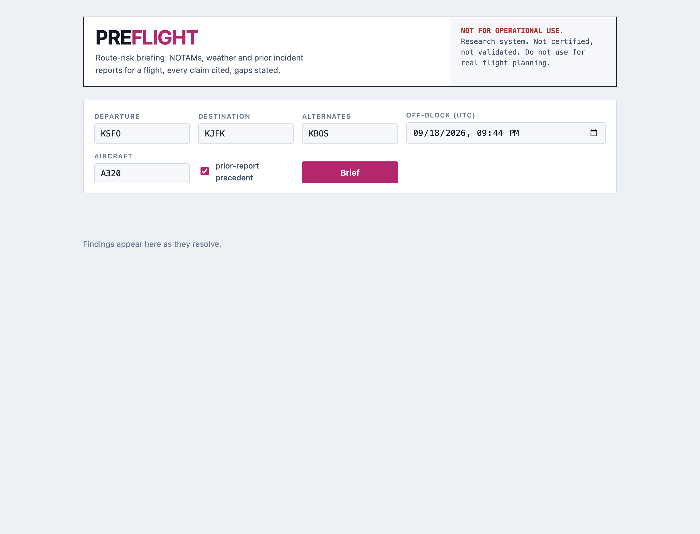

`preflight serve` → http://localhost:8000. A single static page served by FastAPI; no build step,
no framework. The form is the whole input: departure, destination, alternates, off-block time
(UTC), aircraft type, and a checkbox for prior-report precedent. Everything on the page is
theme-aware (a dark-mode capture is at the end).

**Backend at this point:** the API process has loaded the retrieval models (embedder + reranker),
the NLI verifier and connected to Ollama at startup, compiled the LangGraph graph with a Postgres
checkpointer, and is idle.

## 2. Findings stream in

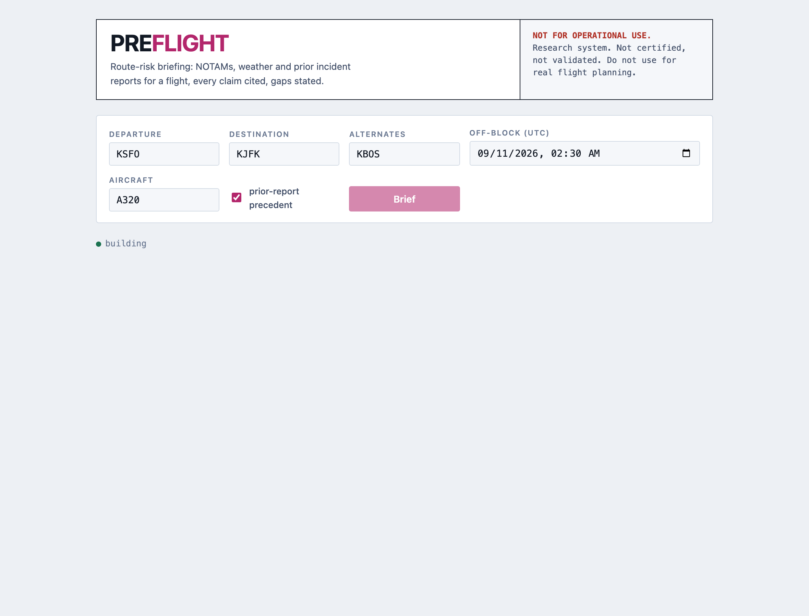

Clicking **Brief** opens a server-sent-events stream (`GET /brief/stream?…`). Findings arrive one
by one, ranked by severity, as soon as the graph has them; the status line reads *building* until
the `done` event. The URL is rewritten with the flight parameters, so a briefing is a link you can
send.

**Backend:** the `gather` node runs the deterministic core against the database *as of now* —
NOTAMs in force during each airport's window, the latest METAR and TAF, a year of arrival-delay
history — and emits findings and abstentions; then `precedent`, `verify` and `narrate` run in
turn, each checkpointed to Postgres so the run can resume by its id if anything dies.

## 3. The complete briefing

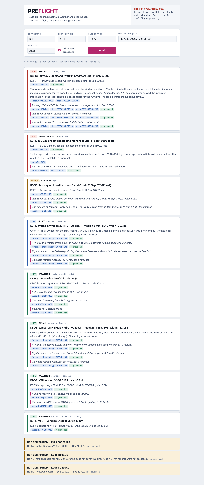

Eight findings, three abstentions, 38 source records considered, 23.7 s end to end with the
language model on. Reading top to bottom:

- **HIGH · RUNWAY** — KSFO Runway 28R closed for work in progress. The core claim (plain sentence
  built from decoded entities, never from raw text) cites the NOTAM and carries **✓ grounded** from
  the NLI verifier. Below it, the **precedent claim**: two prior NTSB investigations whose
  narratives match the scenario “runway closed, crew used the parallel runway, lined up with the
  wrong runway…”, quoted verbatim and cited by case number. Then three italic sentences — written
  by the local model, each verified against the same citations, each marked ✓ grounded.
- **HIGH · APPROACH AIDS** — KJFK ILS 22L unserviceable, with an ASRS precedent about instrument
  failures on approach.
- **MEDIUM · TAXIWAY** — KSFO Taxiway A closed between B and C (a US-domestic-format NOTAM,
  `!SFO 09/142`), with three ASRS precedents about taxi confusion at SFO.
- **LOW / INFO · DELAY** — typical arrival delay at KJFK and KBOS for that weekday and hour from
  BTS history, explicitly labelled *climatology, not a forecast*.
- **INFO · WEATHER** — current METARs decoded (flight category, wind, visibility).

Then the **abstentions**: what the system could not determine and why, each with a machine-readable
reason — here, no TAF covers the arrival window (the sample flight is a week in the past), and KBOS
has no NOTAMs on record at all, so NOTAM hazards there were *not assessed* rather than silently
absent.

## 4. A citation, opened

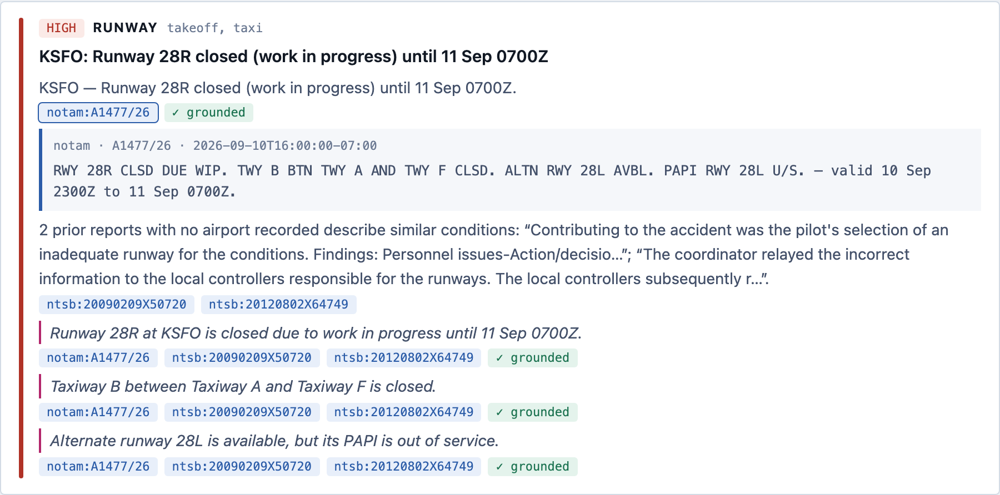

Every citation chip is a button. Opening `notam:A1477/26` shows the record the claim rests on —
the raw NOTAM body, contractions and all, plus the validity window the system decoded. This is the
grounding contract made visible: the schema does not allow a claim without a citation, and the
citation carries a verbatim quote.

**Backend:** the verifier turned this NOTAM into a self-identifying premise (“NOTAM A1477/26 at
KSFO states: Runway 28R closed due to work in progress…”, with a glossary of contractions) and
scored the claim against it; the 0.92 entailment score is in the tooltip.

## 5. Precedent, opened

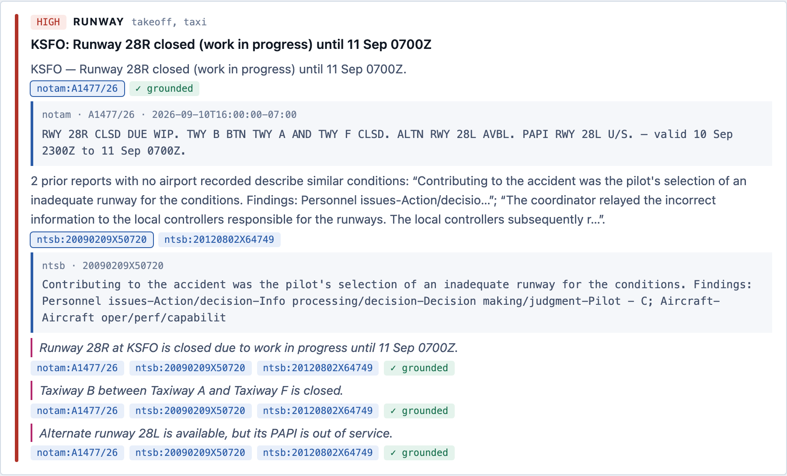

Opening an `ntsb:` chip shows the passage the retriever matched — an NTSB probable-cause narrative
about runway selection. The precedent claim's wording is honest about geography: “2 prior reports
**with no airport recorded**” — the NTSB record did not carry an airport code, and the system says
so instead of implying these happened at SFO.

**Backend:** for each actionable finding, a scenario query (or, with the model on, the model's
rewrite of the hazard into its operational consequence) went through hybrid retrieval — dense
(bge-large, 1024-d, HNSW) and lexical (Postgres `ts_rank`) channels fused by reciprocal rank —
then the cross-encoder reranker; only hits scoring ≥ 0.5 are attached, each report once.

## 6. Weather, decoded and cited

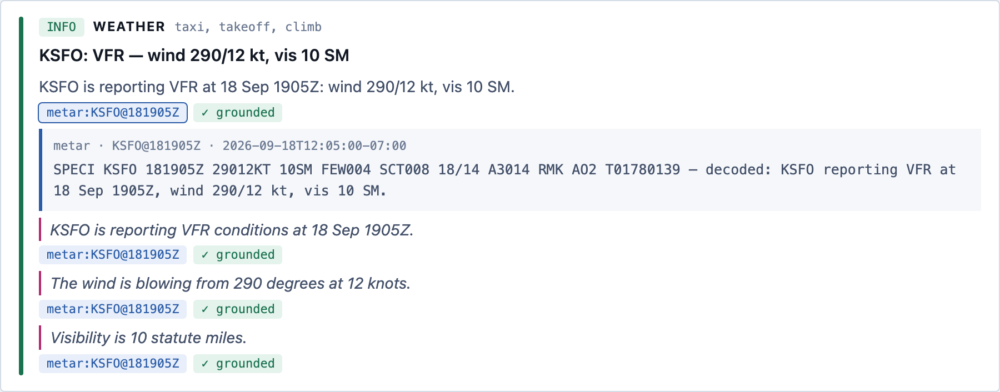

The METAR is quoted raw and decoded in the same citation, so a reader can check the flight category
and wind the system derived. A METAR older than two hours would not appear here at all — it would
be an abstention (`stale_source`).

## 7. What it could not determine

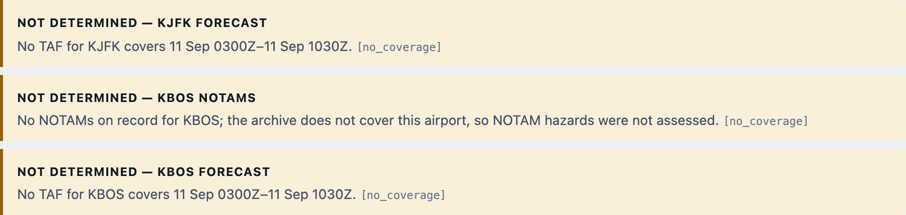

Abstentions are a first-class output with their own evaluation (26 constructed data-gap cases,
recall 1.000, false-abstention 0.000). Six rules produce them: METAR missing or stale, TAF not
covering the window, an airport the archive has never fetched NOTAMs for, no delay history,
decoder-rejected NOTAMs in the latest fetch, and retrieval models unavailable.

## 8. The API

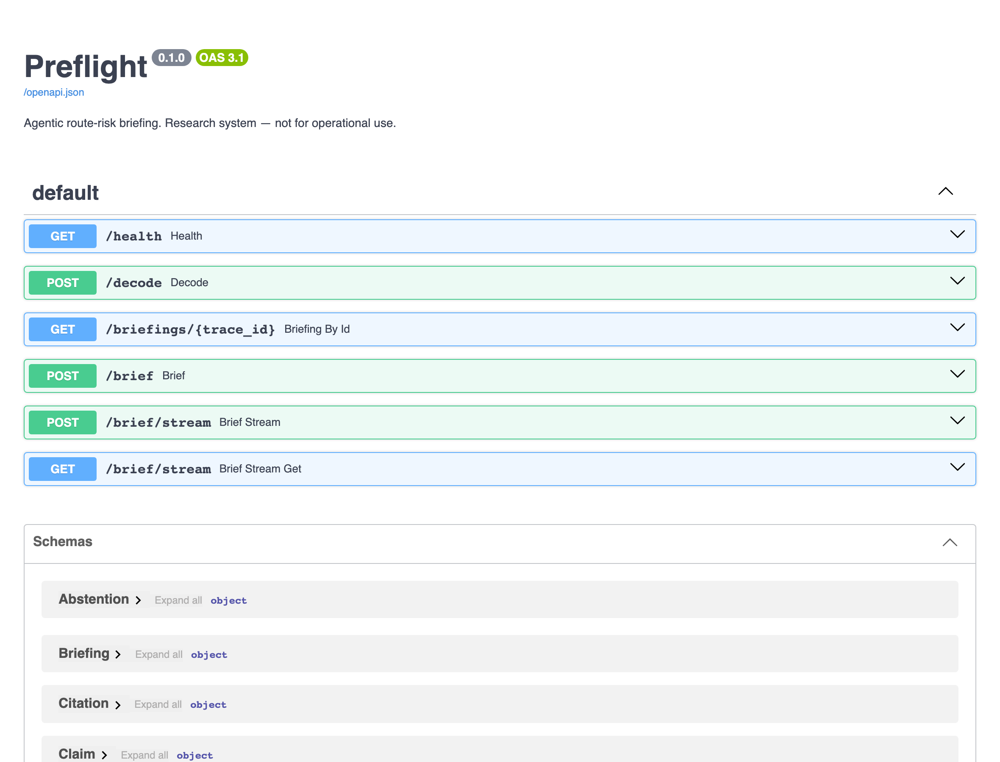

`/docs` is generated from the typed schemas. `POST /brief` returns the full `Briefing` object;
`GET|POST /brief/stream` is what the UI consumes; `GET /briefings/{id}` reads a finished briefing
back from its LangGraph checkpoint by the id the CLI and API return; `POST /decode` decodes one
NOTAM.

## 9. The CLI

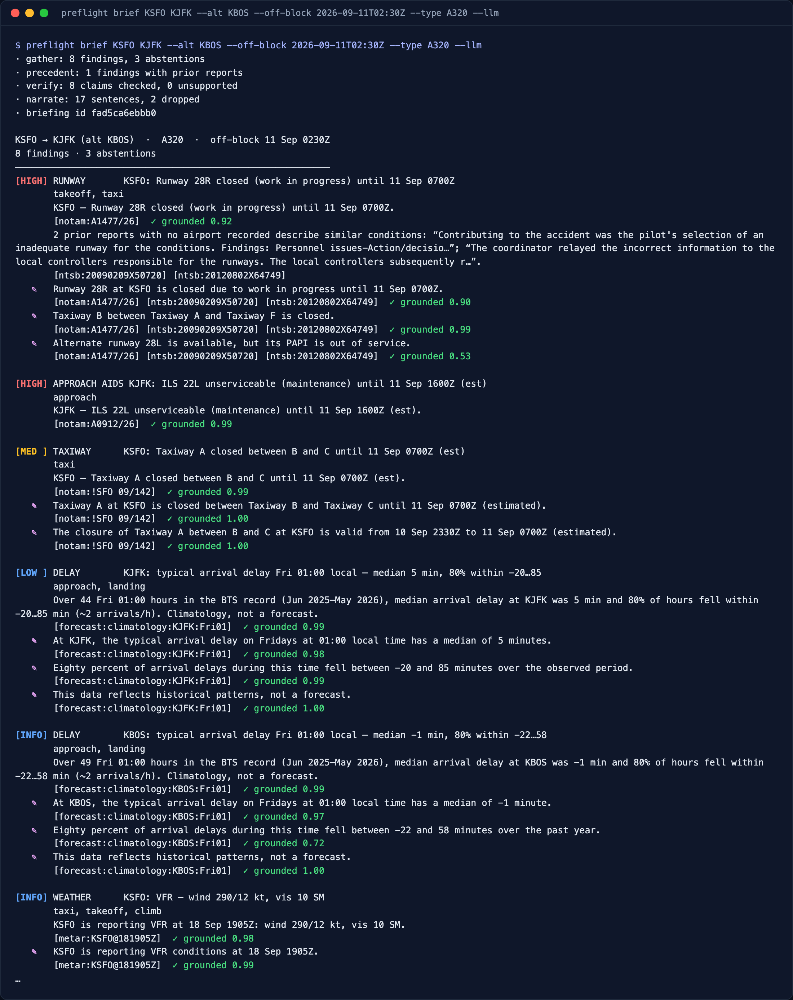

The same briefing in the terminal. The first lines are the graph's trace — `gather: 8 findings,
3 abstentions · precedent: 1 finding with prior reports · verify: 8 claims checked, 0 unsupported
· narrate: 17 sentences, 2 dropped` — and the briefing id, which `--resume ID` or
`GET /briefings/ID` will read back. Model-written sentences are marked ✎ and show their entailment
score; the two the verifier could not support were dropped before rendering, which is the
narrative eval's 1% in action.

## 10. The evaluation gate

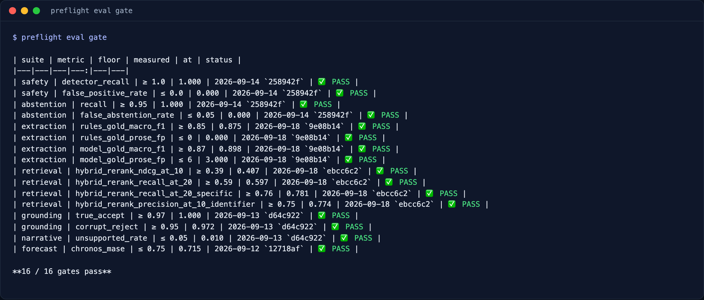

`preflight eval gate` is what CI runs on every pull request: it re-measures the three model-free
suites (injection detector, constructed abstention cases, rule-decoder extraction) against a fresh
database, then holds every committed `summary.json` to the floors in `evals/gates.toml`. Each row
prints the commit the number was measured at, so a stale summary is visible. A number moving the
wrong way fails the build.

## 11. The MCP server

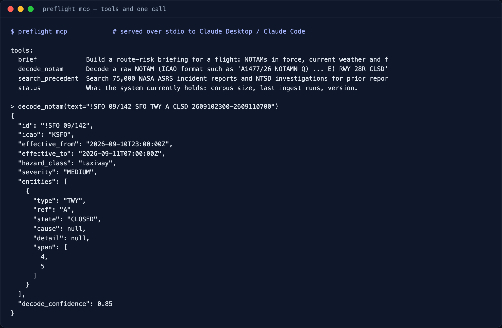

`preflight mcp` serves the same capabilities as tools over stdio. Add it to Claude Desktop or
Claude Code and ask for a briefing in plain language; the assistant calls `brief`, gets the typed
object back, and can open citations with `search_precedent` or decode a NOTAM someone pasted with
`decode_notam`. The call shown decodes a US-domestic NOTAM into its record — airport, validity,
hazard class, severity, entities with character spans, and the decoder's own confidence.

## 12. Dark mode

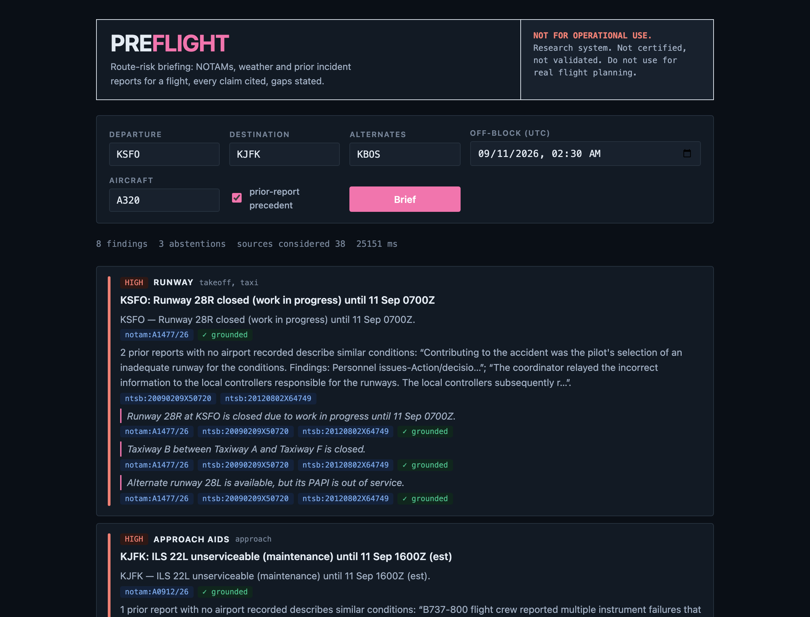

The page follows the system theme; nothing else changes.

---

### Reproducing these screenshots

```bash
make db-start ollama-start
preflight ingest weather KSFO KJFK KBOS       # fresh METAR/TAF
preflight serve &
open "http://localhost:8000/?departure=KSFO&destination=KJFK&alternates=KBOS&off_block=2026-09-11T02:30&aircraft_type=A320&precedent=true"
```

Without Ollama the page still works — findings, citations, precedent and abstentions all come from
the deterministic core and retrieval; only the italic model-written sentences are absent.
